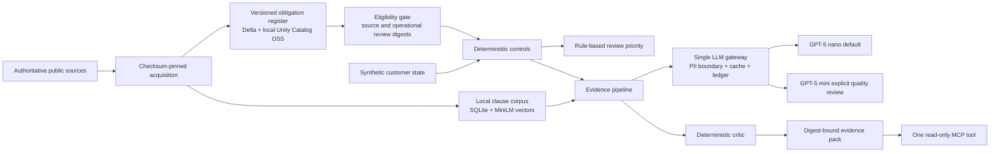

# Solution architecture

ObligationIQ is an independent, local-first reference build for generating cited electricity-compliance evidence packs from versioned regulatory obligations and synthetic customer state. It is not a production compliance service. The deterministic control engine owns status; language models can draft and critique narrative only.

## Components and trust boundaries

| Component | Responsibility | Stored state | Boundary |
|---|---|---|---|
| Source acquisition | Download only declared URLs and verify SHA-256 | Gitignored PDFs/model assets | Network used only during explicit setup |
| Corpus | Page extraction, clause windows, lexical/semantic retrieval | Gitignored SQLite and vectors | Public regulatory text only |
| Register | Candidate, source-review and operational-review binding | Gitignored Delta; public bounded JSON decisions | Digest mismatch fails eligibility |
| Controls | Pure point-in-time status functions | None | Cannot import gateway, agents or ground truth |
| Risk baseline | Review-priority policy over control results | Local MLflow metadata | Not a forecast or compliance decision |
| Agent pipeline | Retrieve, order timeline, draft and critique | Public pack metadata; raw model text stays local | Immutable control status passed through |
| Gateway | Redact, route, reserve, call, settle, cache and log | Gitignored SQLite ledger/cache | Sole model-call module |
| MCP server | Expose the working evidence-pack core | None beyond core stores | One structured, read-only tool |
| Evaluation | Four-arm synthetic benchmark | Public cases/results; isolated ground truth | CI blocks controls/agents from labels |

## Execution paths

The ordinary path is offline. `dry_run` makes no model call; `cached` refuses a miss. Local source parsing, embedding, Delta and MLflow stores are not Azure services. Live mode requires both `LLM_MODE=live` and `LLM_ALLOW_LIVE=true`, valid Entra CLI authentication, a fresh price pin and matching Azure account/deployment metadata.

Before a paid request, SQLite `BEGIN IMMEDIATE` admits one reservation against the 1 AUD daily and 6 AUD lifetime limits. The reservation uses maximum bounded input/output tokens plus 25% headroom. A successful response commits returned token usage and the response cache atomically. An exact repeat creates no reservation.

Failure classification is part of the cost-control architecture. A complete Azure 429 `rate_limit_exceeded` response proves capacity rejection before execution, so the reservation is released and serial retry follows `Retry-After` or bounded jittered backoff. A connection drop, mid-stream timeout or malformed response does not prove non-consumption; it settles at maximum under ADR-008. Phase 7 exposed the consequence of getting this distinction wrong: five 429s overstated the conservative ledger by **0.003565 AUD**, enough to exhaust the ambiguity limit even though the provider consumed no tokens. A reservation ledger without provider-aware failure classification can halt itself while silently inflating unit cost.

## Measured routing decision

On the same 72 synthetic cases, GPT-5 nano and mini had identical detection metrics, evidence completeness, citation accuracy and refusal correctness. Mini improved groundedness and critic acceptance by 2.78 percentage points, while costing 5.51 times more and adding 1.429 seconds to mean metered response latency. Nano remains the default. Mini is available only through an explicit `quality_review` escalation reason; it never gains authority over status.

## Deployment boundary

Azure contains an S0 OpenAI account and two Global Standard model deployments in an Australia East account. Global Standard may process elsewhere. The application, corpus, register, ledger, MCP server and evaluation run locally. No Foundry project, managed Databricks, AI Search, storage account, API Management, CRM integration or production endpoint exists.

## Extension rules

A production design must add authenticated service boundaries, managed secret/identity handling, durable multi-user storage, source-system completeness contracts, official holiday calendars, invoice reconciliation, Australian processing review and legal sign-off. A new obligation needs pinned source evidence, separate source and operational review, digest binding, a control callable and challenge cases before it can become eligible. A source digest change removes eligibility automatically.
